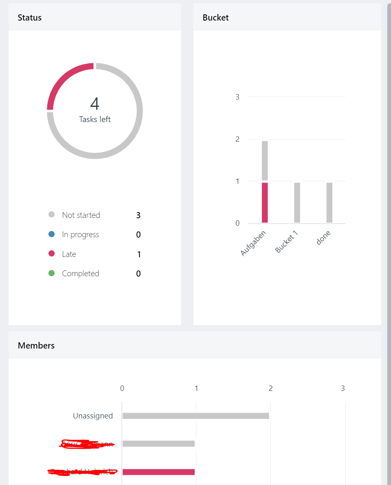

# Informationen zum Bachelor Projekt 5. Semester DM (WS 18/19)

Allgemeine Informationen zur Veranstaltung

## Anforderungen des Kunden an die Anwendung

Der Kunde erwartet die Erstellung einer Sammlung von Reportingwerkzeugen für ein agiles Projektmanagement. Die einzelnen Reports sollen als SPFx WebParts zur Verfügung gestellt werden und nach Möglichkeit unterschiedliche Konfigurationen zulassen. Darüber hinaus ist es wünschenswert, wenn live Filter sich auf Report-WebParts der gleichen Seite auswirken. Im Einzelnen werden folgende Reports erwartet.

1. Einfache Darstellung des aktuellen Status
    - Statusdiagram (Kreisdiagramm)
    - Balkendiagram (bsp. Bucket) y:Anzahl/StoryPoints; x:Tag
    - Balkendiagram (bsp. Members) y:Personen, x:Anzahl/StoryPoints
    - Tag-Cloud mit Gewichtung der Begriffe
  

2. Burndown Diagram
    - Details müssen noch definiert werden
    - eventuell kombiniert mit 4.

3. Velocity Diagram 
    - Details müssen noch definiert werden

4. Cumulative Flow Diagram
   - [cumulative-flow-diagram](https://kanbanize.com/kanban-resources/kanban-analytics/cumulative-flow-diagram/) 

5. Throughput-Histogram
    - [throughput-histogram](https://kanbanize.com/kanban-resources/kanban-analytics/throughput-histogram/)

6. Cycle Time

### Nicht funktionale Anforderung

- Ladevorgänge müssen dem Benutzer immer signalisiert werden, besonders langlaufende Ladevorgänge.
- Bei langlaufenden Datenaufbereitungen ist darauf zu achten, dass die Ergebnisse nach Möglichkeit zwischengespeichert werden, um ein erneutes Laden / Berechnen beim erneuten Aufruf der Seite zu vermeiden.

### Zielplattform und Technologie

- SharePoint Online - Office 356
- [SharePoint Framework (SPFx)](https://docs.microsoft.com/en-us/sharepoint/dev/spfx/sharepoint-framework-overview)

## Vorgeschlagene Programmiersprachen / Frameworks

Die Wahl der Programmiersprache und verwendeten Frameworks ist grundlegend frei. Es ist jedoch zu empfehlen, mit folgenden Programmiersprachen und Frameworks zu arbeiten.
|    |                                                                                                                  |                                                                                                            |
| -- | ---------------------------------------------------------------------------------------------------------------- | ---------------------------------------------------------------------------------------------------------- |
| 1. | [TypeScript](https://www.typescriptlang.org/index.html)                                                          | *(Typisierte Programmiersprache die in JavaScript kompiliert wird.)*                                       |
| 2. | [React](https://reactjs.org/)                                                                                    | *(JS Framework zum erstellen von Benutzerschnittstellen)*                                                  |
| 3. | [TypeScript, React, WebPack im Zusammenspiel](https://www.typescriptlang.org/docs/handbook/react-&-webpack.html) |                                                                                                            |
| 4. | [Office Fabric UI](https://developer.microsoft.com/en-us/fabric)                                                 | Frontend Framework für Office 365 Komponenten, Layouts, Icons *(nativ React)*                              |
| 5. |                                                                                                                  | diverse JS Libraries, die Chart- und Graph-Darstellungen ermöglichen *(bitte eine eigene Auswahl treffen)* |

## Weiter Informationen

|                                                                     |                                                                                                       |
| --------------------------------------------------------------------------- | ------------------------------------------------------------------------------------------------------------- |
| [development tenant agile-is](https://agileis.sharepoint.com/sites/ws1819/) | Entwicklungsumgebung auf der auch das Agile Task Board installiert ist. Hier finden die Kundenabnahmen statt. |
| [Node.Js](https://nodejs.org/en/)                                           | JavaScript runtime auf der Basis von Chrome's V JavaScript engine                                             |
| [yeoman](http://yeoman.io/)                                                 | Projekt-Template Generator für Web-Projekte                                                                   |
| [webpack](https://webpack.js.org/)                                          | Bundle-Werkzeug für Web-Projekte                                                                              |
| [gulp.js](https://gulpjs.com/)                                              | Taskrunner für Node.JS                                                                                        |